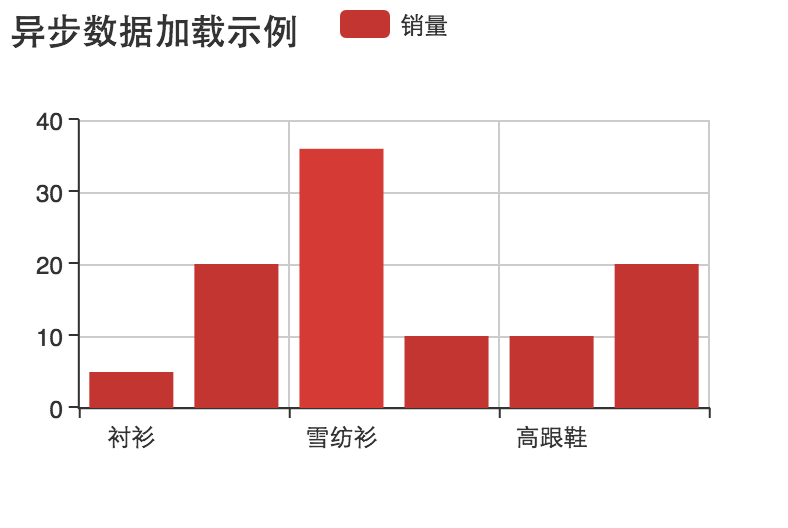
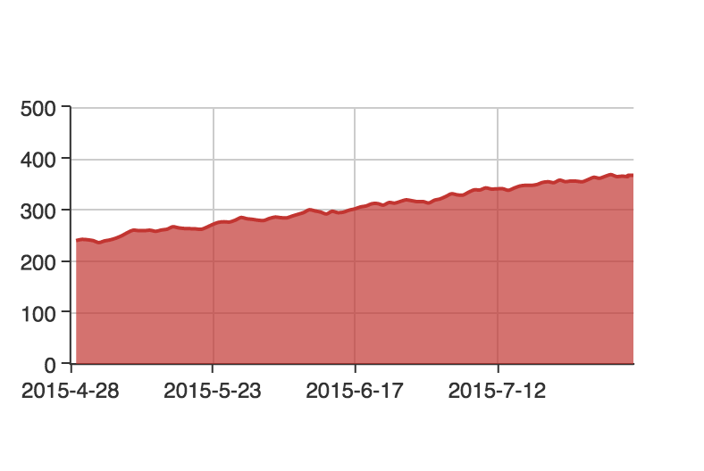

#  异步数据加载和更新
## 异步加载

入门示例中的数据是在初始化后setOption中直接填入的，但是很多时候可能数据需要异步加载后再填入。ECharts 中实现异步数据的更新非常简单，在图表初始化后不管任何时候只要通过 jQuery 等工具异步获取数据后通过 setOption 填入数据和配置项就行。

```
var myChart = echarts.init(document.getElementById('main'));

$.get('data.json').done(function (data) {
    myChart.setOption({
        title: {
            text: '异步数据加载示例'
        },
        tooltip: {},
        legend: {
            data:['销量']
        },
        xAxis: {
            data: ["衬衫","羊毛衫","雪纺衫","裤子","高跟鞋","袜子"]
        },
        yAxis: {},
        series: [{
            name: '销量',
            type: 'bar',
            data: [5, 20, 36, 10, 10, 20]
        }]
    });
});
```

或者先设置完其它的样式，显示一个空的直角坐标轴，然后获取数据后填入数据。

```
var myChart = echarts.init(document.getElementById('main'));
// 显示标题，图例和空的坐标轴
myChart.setOption({
    title: {
        text: '异步数据加载示例'
    },
    tooltip: {},
    legend: {
        data:['销量']
    },
    xAxis: {
        data: []
    },
    yAxis: {},
    series: [{
        name: '销量',
        type: 'bar',
        data: []
    }]
});

// 异步加载数据
$.get('data.json').done(function (data) {
    // 填入数据
    myChart.setOption({
        xAxis: {
            data: data.categories
        },
        series: [{
            // 根据名字对应到相应的系列
            name: '销量',
            data: data.data
        }]
    });
});

```
如下：


ECharts 中在更新数据的时候需要通过name属性对应到相应的系列，上面示例中如果 name不存在也可以根据系列的顺序正常更新，但是更多时候推荐更新数据的时候加上系列的name数据。

loading 动画

如果数据加载时间较长，一个空的坐标轴放在画布上也会让用户觉得是不是产生 bug 了，因此需要一个 loading 的动画来提示用户数据正在加载。

ECharts 默认有提供了一个简单的加载动画。只需要调用 showLoading 方法显示。数据加载完成后再调用 hideLoading 方法隐藏加载动画。

```
myChart.showLoading();
$.get('data.json').done(function (data) {
    myChart.hideLoading();
    myChart.setOption(...);
});

```

效果如下：




### 数据的动态更新

ECharts 由数据驱动，数据的改变驱动图表展现的改变，因此动态数据的实现也变得异常简单。

所有数据的更新都通过 setOption实现，你只需要定时获取数据，setOption 填入数据，而不用考虑数据到底产生了那些变化，ECharts 会找到两组数据之间的差异然后通过合适的动画去表现数据的变化。

ECharts 3 中移除了 ECharts 2 中的 addData 方法。如果只需要加入单个数据，可以先 data.push(value) 后 setOption

具体可以看下面示例：




