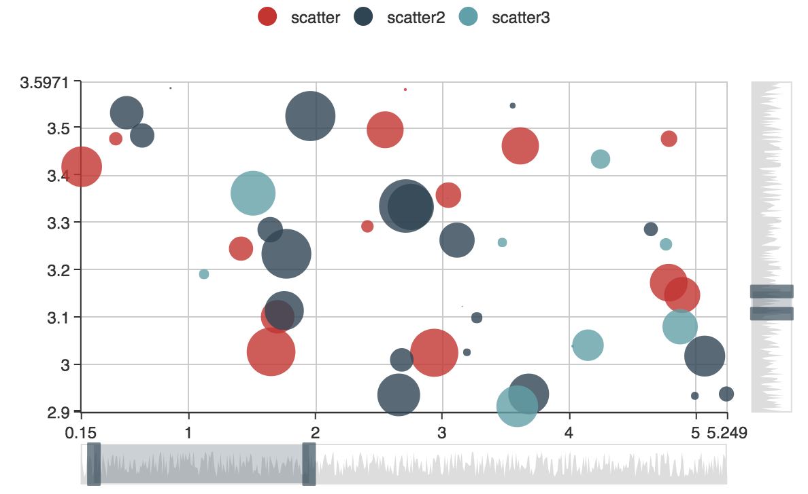
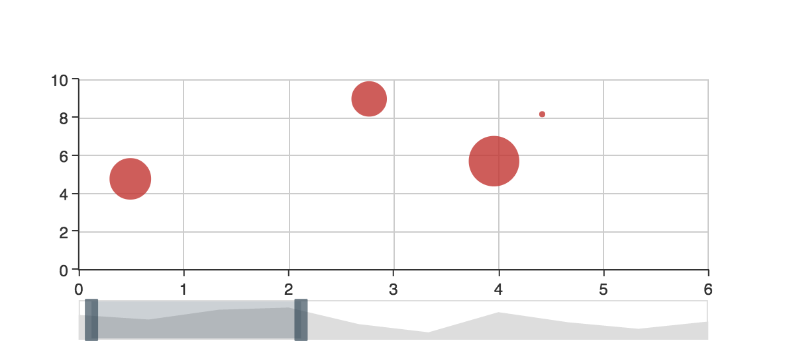
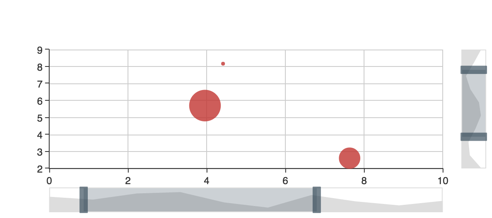

## 在图表中加入交互组件
除了图表外 ECharts 中，提供了很多交互组件。例如：

图例组件 legend、标题组件 title、视觉映射组件 visualMap、数据区域缩放组件 dataZoom、时间线组件 timeline

下面以 数据区域缩放组件 dataZoom 为例，介绍如何加入这种组件。


数据区域缩放组件（dataZoom）介绍

『概览数据整体，按需关注数据细节』是数据可视化的基本交互需求。dataZoom 组件能够在直角坐标系（grid）、极坐标系（polar）中实现这一功能。

如下例子：




dataZoom 组件是对 数轴（axis） 进行『数据窗口缩放』『数据窗口平移』操作。
可以通过 dataZoom.xAxisIndex 或 dataZoom.yAxisIndex 或 dataZoom.radiusAxisIndex 或 dataZoom.angleAxisIndex 来指定 dataZoom 控制哪个或哪些数轴。

dataZoom 组件可同时存在多个，起到共同控制的作用。控制同一个数轴的组件，会自动联动。下面例子中会详细说明。

dataZoom 的运行原理是通过『数据过滤』来达到『数据窗口缩放』的效果。

数据过滤模式的设置不同，效果也不同，参见：dataZoom.filterMode。

dataZoom 的数据窗口范围的设置，目前支持两种形式：

百分比形式：参见 dataZoom.start 和 dataZoom.end。

绝对数值形式：参见 dataZoom.startValue 和 dataZoom.endValue。

dataZoom 组件现在支持几种子组件：

内置型数据区域缩放组件（dataZoomInside）：内置于坐标系中。

滑动条型数据区域缩放组件（dataZoomSlider）：有单独的滑动条操作。

框选型数据区域缩放组件（dataZoomSelect）：全屏的选框进行数据区域缩放。入口和配置项均在 toolbox中。


在代码加入 dataZoom 组件

先只在对单独一个横轴，加上 dataZoom 组件，代码示例如下：


```
option = {
    xAxis: {
        type: 'value'
    },
    yAxis: {
        type: 'value'
    },
    dataZoom: [
        {   // 这个dataZoom组件，默认控制x轴。
            type: 'slider', // 这个 dataZoom 组件是 slider 型 dataZoom 组件
            start: 10,      // 左边在 10% 的位置。
            end: 60         // 右边在 60% 的位置。
        }
    ],
    series: [
        {
            type: 'scatter', // 这是个『散点图』
            itemStyle: {
                normal: {
                    opacity: 0.8
                }
            },
            symbolSize: function (val) {
                return val[2] * 40;
            },
            data: [["14.616","7.241","0.896"],["3.958","5.701","0.955"],["2.768","8.971","0.669"],["9.051","9.710","0.171"],["14.046","4.182","0.536"],["12.295","1.429","0.962"],["4.417","8.167","0.113"],["0.492","4.771","0.785"],["7.632","2.605","0.645"],["14.242","5.042","0.368"]]
        }
    ]
}
```


可以看到如下结果：



上面的图只能拖动 dataZoom 组件导致窗口变化。如果想在坐标系内进行拖动，以及用滚轮（或移动触屏上的两指滑动）进行缩放，那么要再加上一个 inside 型的 dataZoom组件。
直接在上面的 option.dataZoom 中增加即可：

option = {
    ...,
    dataZoom: [
        {   // 这个dataZoom组件，默认控制x轴。
            type: 'slider', // 这个 dataZoom 组件是 slider 型 dataZoom 组件
            start: 10,      // 左边在 10% 的位置。
            end: 60         // 右边在 60% 的位置。
        },
        {   // 这个dataZoom组件，也控制x轴。
            type: 'inside', // 这个 dataZoom 组件是 inside 型 dataZoom 组件
            start: 10,      // 左边在 10% 的位置。
            end: 60         // 右边在 60% 的位置。
        }
    ],
    ...
}
可以看到如下结果（能在坐标系中进行滑动，以及使用滚轮缩放了）：


如果想 y轴 也能够缩放，那么在y轴上也加上 dataZoom组件：

```
option = {
    ...,
    dataZoom: [
        {
            type: 'slider',
            xAxisIndex: 0,
            start: 10,
            end: 60
        },
        {
            type: 'inside',
            xAxisIndex: 0,
            start: 10,
            end: 60
        },
        {
            type: 'slider',
            yAxisIndex: 0,
            start: 30,
            end: 80
        },
        {
            type: 'inside',
            yAxisIndex: 0,
            start: 30,
            end: 80
        }
    ],
    ...
}

```
可以看到如下结果：

