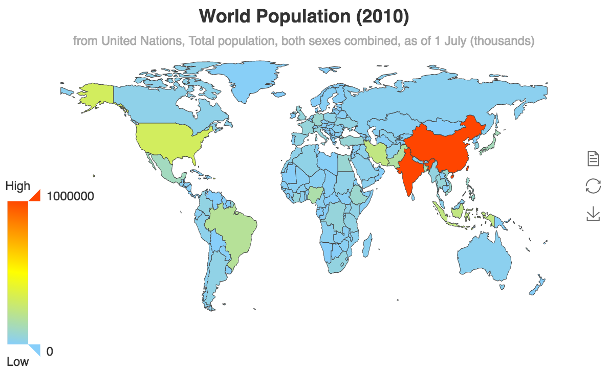

## 数据的视觉映射
数据可视化是 数据 到 视觉元素 的映射过程（这个过程也可称为视觉编码，视觉元素也可称为视觉通道）。

ECharts 的每种图表本身就内置了这种映射过程，比如折线图把数据映射到『线』，柱状图把数据映射到『长度』。一些更复杂的图表，如 graph、事件河流图、treemap 也都会做出他们内置的映射。

此外，ECharts 还提供了 viusalMap 组件 来提供通用的视觉映射。visualMap 组件中可以使用的视觉元素有：
图形类别（symbol）、图形大小（symbolSize）
颜色（color）、颜色透明度（colorAlpha）、
颜色明暗度（colorLightness）、颜色饱和度（colorSaturation）、色调（colorHue）

下面对 visualMap 组件的使用方式进行简要的介绍。


## 数据和维度

ECharts中的数据，一般存放于 series.data 中。根据图表类型不同，数据的具体形式也可能有些许差异。比如可能是『线性表』、『树』、『图』等。但他们都有个共性：都是『数据项（dataItem）』的集合。每个数据项含有『数据值（value）』和其他信息（如果需要的话）。每个数据值，可以是单一的数值（一维）或者一个数组（多维）。

例如，series.data 最常见的形式，是『线性表』，即一个普通数组：

```
series: {
    data: [
        {       // 这里每一个项就是数据项（dataItem）
            value: 2323, // 这是数据项的数据值（value）
            itemStyle: {...}
        },
        1212,   // 也可以直接是 dataItem 的 value，这更常见。
        2323,   // 每个 value 都是『一维』的。
        4343,
        3434
    ]
}
series: {
    data: [
        {                        // 这里每一个项就是数据项（dataItem）
            value: [3434, 129,  '圣马力诺'], // 这是数据项的数据值（value）
            itemStyle: {...}
        },
        [1212, 5454, '梵蒂冈'],   // 也可以直接是 dataItem 的 value，这更常见。
        [2323, 3223, '瑙鲁'],     // 每个 value 都是『三维』的，每列是一个维度。
        [4343, 23,   '图瓦卢']    // 假如是『气泡图』，常见第一维度映射到x轴，
                                 // 第二维度映射到y轴，
                                 // 第三维度映射到气泡半径（symbolSize）
    ]
}

```

在图表中，往往默认把 value 的前一两个维度进行映射，比如取第一个维度映射到x轴，取第二个维度映射到y轴。如果想要把更多的维度展现出来，可以借助 visualMap 。最常见的情况，气泡图（scatter） 使用半径展现了第三个维度。


visualMap 组件

visualMap 组件定义了把数据的『哪个维度』映射到『什么视觉元素上』。

现在提供如下两种类型的visualMap组件，通过 visualMap.type 来区分。

其定义结构例如：

```
option = {
    visualMap: [ // 可以同时定义多个 visualMap 组件。
        { // 第一个 visualMap 组件
            type: 'continuous', // 定义为连续型 viusalMap
            ...
        },
        { // 第二个 visualMap 组件
            type: 'piecewise', // 定义为分段型 visualMap
            ...
        }
    ],
    ...
};
```
