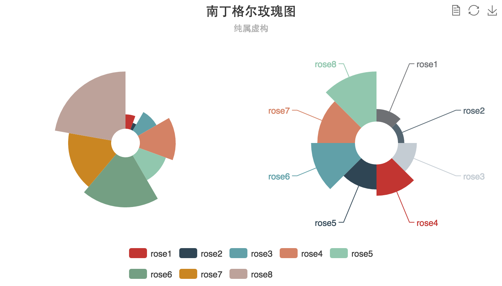
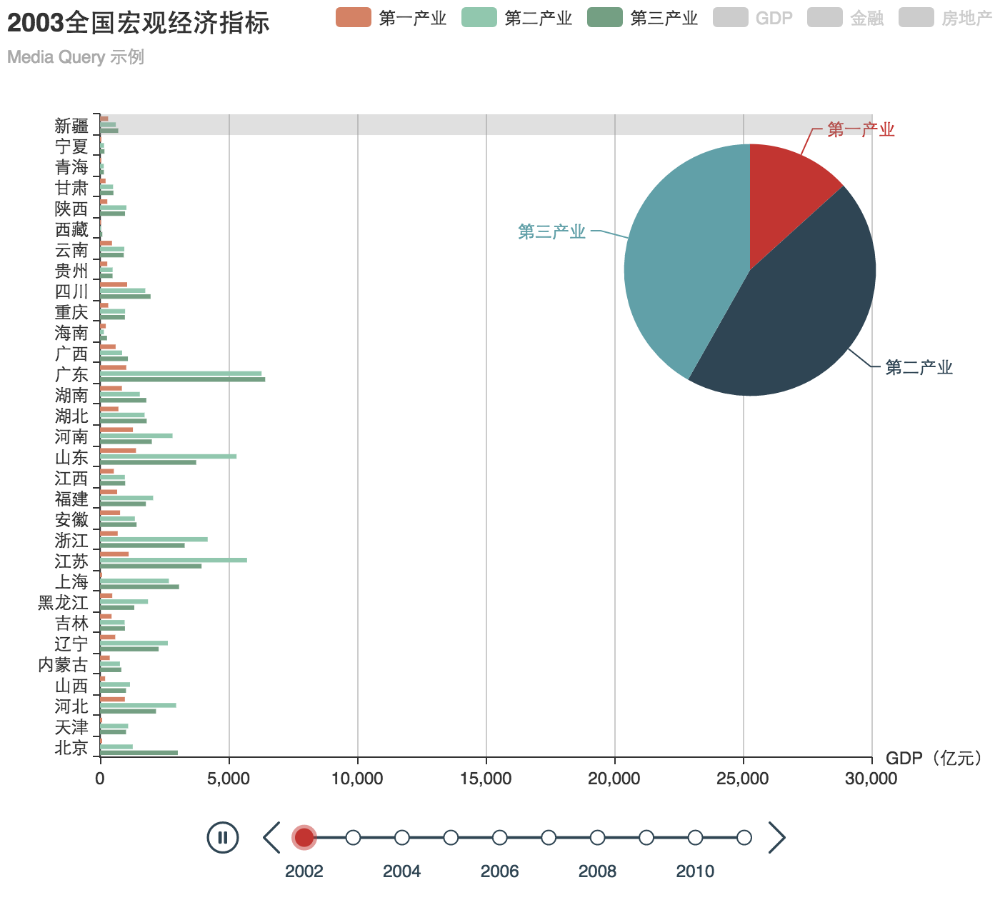

## 移动端自适应
ECharts 工作在用户指定高宽的 dom 节点（容器）中，ECharts 的『组件』和『系列』都在这个 dom 节点中，每个节点都可以由用户指定位置。图表库内部并不适宜实现 dom 文档流布局，而是实现简单容易理解的类似绝对布局。但是有时候容器尺寸极端时，这种方式并不能自动避免组件重叠的情况，尤其在移动端小屏的情况下。

另外，有时会出现一个图表需要同时在PC、移动端上展现的场景。这需要ECharts 内部组件随着容器尺寸变化而变化的能力。

为了解决这个问题，ECharts 完善了组件的定位设置，并且实现了类似 CSS Media Query 的自适应能力。


ECharts组件的定位和布局

大部分『组件』和『系列』会遵循两种定位方式：


left/right/top/bottom/width/height 定位方式：

这六个量中，每个量都可以是『绝对值』或者『百分比』或者『位置描述』。

绝对值

单位是浏览器像素（px），用 number 形式书写（不写单位）。例如 {left: 23, height: 400}。

### 百分比

表示占 dom 容器高宽的百分之多少，用 string 形式书写。例如 {right: '30%', bottom: '40%'}。

### 位置描述

可以设置 left: 'center'，表示水平居中。
可以设置 top: 'middle'，表示垂直居中。
这六个量的概念，和 css 中六个量的概念类似：

left：距离 dom 容器左边界的距离。
right：距离 dom 容器右边界的距离。
top：距离 dom 容器上边界的距离。
bottom：距离 dom 容器下边界的距离。
width：宽度。
height：高度。
在横向，left、right、width 三个量中，只需两个量有值即可，因为任两个量可以决定组件的位置和大小，例如 left 和 right 或者 right 和 width 都可以决定组件的位置和大小。 纵向，top、bottom、height 三个量，和横向类同不赘述。


center/radius 定位方式：

center

是一个数组，表示 [x, y]，其中，x、y可以是『绝对值』或者『百分比』，含义和前述相同。

radius

是一个数组，表示 [内半径, 外半径]，其中，内外半径可以是『绝对值』或者『百分比』，含义和前述相同。

在自适应容器大小时，百分比设置是很有用的。


横向（horizontal）和纵向（vertical）

ECharts的『外观狭长』型的组件（如 legend、visualMap、dataZoom、timeline等），大多提供了『横向布局』『纵向布局』的选择。例如，在细长的移动端屏幕上，可能适合使用『纵向布局』；在PC宽屏上，可能适合使用『横向布局』。

横纵向布局的设置，一般在『组件』或者『系列』的 orient 或者 layout 配置项上，设置为 'horizontal' 或者 'vertical'。


于 ECharts2 的兼容：

ECharts2 中的 x/x2/y/y2 的命名方式仍被兼容，对应于 left/right/top/bottom。但是建议写 left/right/top/bottom。

位置描述中，为兼容 ECharts2，可以支持一些看起来略奇怪的设置：left: 'right'、left: 'left'、top: 'bottom'、top: 'top'。这些语句分别等效于：right: 0、left: 0、bottom: 0、top: 0，写成后者就不奇怪了。


Media Query

Media Query 提供了『随着容器尺寸改变而改变』的能力。

如下例子，可尝试拖动右下角的圆点，随着尺寸变化，legend 和 系列 会自动改变布局位置和方式。




要在 option 中设置 Media Query 须遵循如下框架格式：

```
option = {
    baseOption: { // 这里是基本的『原子option』。
        title: {...},
        legend: {...},
        series: [{...}, {...}, ...],
        ...
    },
    media: [ // 这里定义了 media query 的逐条规则。
        {
            query: {...},   // 这里写规则。
            option: {       // 这里写此规则满足下的option。
                legend: {...},
                ...
            }
        },
        {
            query: {...},   // 第二个规则。
            option: {       // 第二个规则对应的option。
                legend: {...},
                ...
            }
        },
        {                   // 这条里没有写规则，表示『默认』，
            option: {       // 即所有规则都不满足时，采纳这个option。
                legend: {...},
                ...
            }
        }
    ]
};

```

上面的例子框架中，baseOption、以及 media 每个 option 都是『原子option』，即普通的含有各组件、系列定义的option。baseOption 是必然被使用的，此外，满足了某个 query 条件时，对应的 option 会被使用 chart.mergeOption() 来 merge 进去。

query：

每个 query 类似于这样：

{
    minWidth: 200,
    maxHeight: 300,
    minAspectRatio: 1.3
}
现在支持三个属性：width、height、aspectRatio（长宽比）。每个属性都可以加上 min 或 max 前缀。比如，minWidth: 200 表示『大于等于200px宽度』。两个属性一起写表示『并且』，比如：{minWidth: 200, maxHeight: 300} 表示『大于等于200px宽度，并且小于等于300px高度』。

option：

media中的option既然是『原子option』，理论上可以写任何option的配置项。但是一般我们只写跟布局定位相关的，例如截取上面例子中的一部分 query option：

```
media: [
    ...,
    {
        query: {
            maxAspectRatio: 1           // 当长宽比小于1时。
        },
        option: {
            legend: {                   // legend 放在底部中间。
                right: 'center',
                bottom: 0,
                orient: 'horizontal'    // legend 横向布局。
            },
            series: [                   // 两个饼图左右布局。
                {
                    radius: [20, '50%'],
                    center: ['50%', '30%']
                },
                {
                    radius: [30, '50%'],
                    center: ['50%', '70%']
                }
            ]
        }
    },
    {
        query: {
            maxWidth: 500               // 当容器宽度小于 500 时。
        },
        option: {
            legend: {
                right: 10,              // legend 放置在右侧中间。
                top: '15%',
                orient: 'vertical'      // 纵向布局。
            },
            series: [                   // 两个饼图上下布局。
                {
                    radius: [20, '50%'],
                    center: ['50%', '30%']
                },
                {
                    radius: [30, '50%'],
                    center: ['50%', '75%']
                }
            ]
        }
    },
    ...
]

```

多个 query 被满足时的优先级：

注意，可以有多个 query 同时被满足，会都被 mergeOption，定义在后的后被 merge（即优先级更高）。

默认 query：

如果 media 中有某项不写 query，则表示『默认值』，即所有规则都不满足时，采纳这个option。

容器大小实时变化时的注意：

在不少情况下，并不需要容器dom节点任意随着拖拽变化大小，而是只是根据不同终端设置几个典型尺寸。

但是如果容器dom节点需要能任意随着拖拽变化大小，那么目前使用时需要注意这件事：某个配置项，如果在某一个 query option 中出现，那么在其他 query option 中也必须出现，否则不能够回归到原来的状态。（left/right/top/bottom/width/height 不受这个限制。）


最后看一个和时间轴结合的例子：
