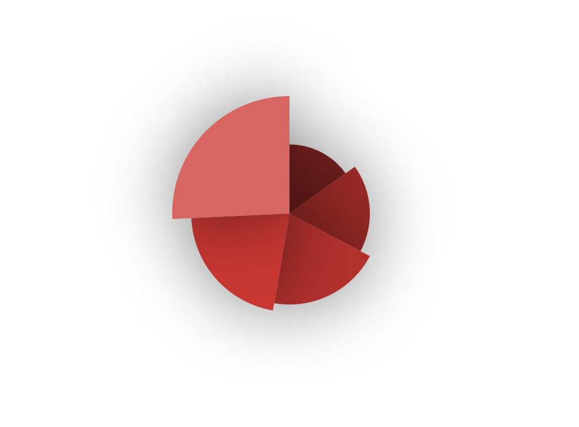
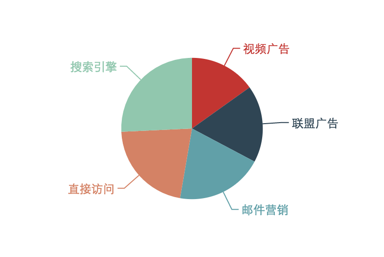
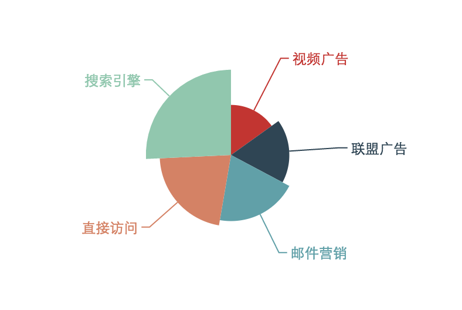
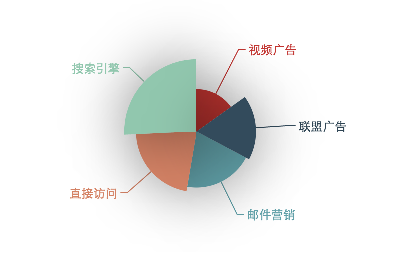
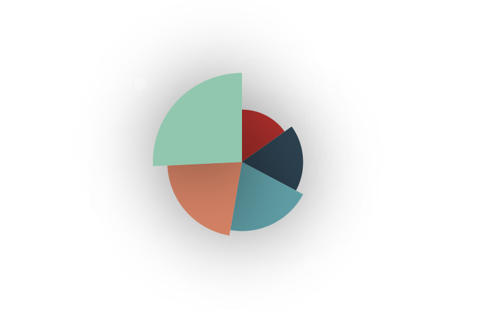
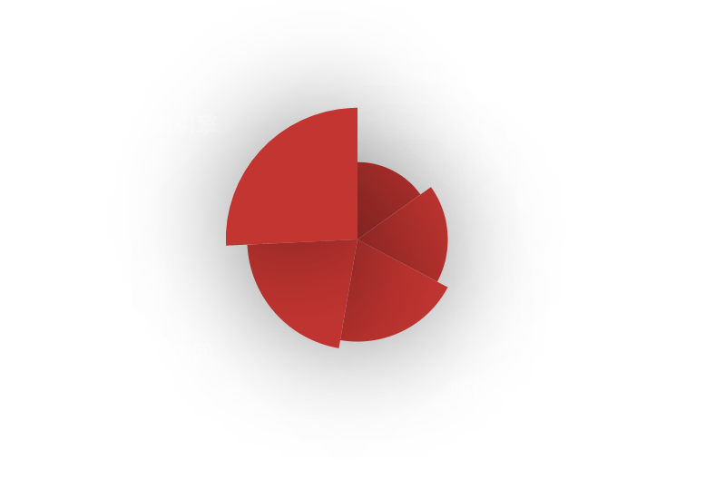

## 个性化图表的样式
ECharts 提供了丰富的自定义配置选项，并且能够从全局、系列、数据三个层级去设置数据图形的样式。下面我们来看如何使用 ECharts 实现下面这个南丁格尔图：



## 绘制南丁格尔图

上一篇中讲了如何绘制一个简单的柱状图，这次要画的是饼图，饼图主要是通过扇形的弧度表现不同类目的数据在总和中的占比，它的数据格式比柱状图更简单，只有一维的数值，不需要给类目。因为不在直角坐标系上，所以也不需要xAxis，yAxis。


```
myChart.setOption({
    series : [
        {
            name: '访问来源',
            type: 'pie',
            radius: '55%',
            data:[
                {value:400, name:'搜索引擎'},
                {value:335, name:'直接访问'},
                {value:310, name:'邮件营销'},
                {value:274, name:'联盟广告'},
                {value:235, name:'视频广告'}
            ]
        }
    ]
})

```

上面代码就能画出一个简单的饼图：



这里data属性值不像入门教程里那样每一项都是单个数值，而是一个包含 name 和 value 属性的对象，ECharts 中的数据项都是既可以只设成数值，也可以设成一个包含有名称、该数据图形的样式配置、标签配置的对象，具体见 data 文档。

ECharts 中的饼图也支持通过设置 roseType 显示成南丁格尔图。

```
roseType: 'angle'

```
南丁格尔图会通过半径表示数据的大小。




## 阴影的配置

ECharts 中有一些通用的样式，诸如阴影、透明度、颜色、边框颜色、边框宽度等，这些样式一般都会在系列的 itemStyle 里设置。例如阴影的样式可以通过下面几个配置项设置：

```
itemStyle: {
    normal: {
        // 阴影的大小
        shadowBlur: 200,
        // 阴影水平方向上的偏移
        shadowOffsetX: 0,
        // 阴影垂直方向上的偏移
        shadowOffsetY: 0,
        // 阴影颜色
        shadowColor: 'rgba(0, 0, 0, 0.5)'
    }
}
```
加上阴影后的效果：



itemStyle都会有normal和emphasis两个选项，normal选项是正常展示下的样式，emphasis是鼠标 hover 时候的高亮样式。这个示例里是正常的样式下加阴影，但是可能更多的时候是 hover 的时候通过阴影突出。

```
itemStyle: {
    emphasis: {
        shadowBlur: 200,
        shadowColor: 'rgba(0, 0, 0, 0.5)'
    }
}

```

## 深色背景和浅色标签

现在我们需要把整个主题改成开始的示例中那样的深色主题，这就需要改背景色和文本颜色。

背景色是全局的，所以直接在 option 下设置 backgroundColor

```
setOption({
    backgroundColor: '#2c343c'
})

```

文本的样式可以设置全局的 textStyle。

```
setOption({
    textStyle: {
        color: 'rgba(255, 255, 255, 0.3)'
    }
})
```

也可以每个系列分别设置，每个系列的文本设置在 label.normal.textStyle。

```
label: {
    normal: {
        textStyle: {
            color: 'rgba(255, 255, 255, 0.3)'
        }
    }
}
```

饼图的话还要将标签的视觉引导线的颜色设为浅色。

```
labelLine: {
    normal: {
        lineStyle: {
            color: 'rgba(255, 255, 255, 0.3)'
        }
    }
}
```


## 设置扇形的颜色

扇形的颜色也是在 itemStyle 中设置：

```
itemStyle: {
    normal: {
        // 设置扇形的颜色
        color: '#c23531',
        shadowBlur: 200,
        shadowColor: 'rgba(0, 0, 0, 0.5)'
    }
}
```


跟我们要实现的效果已经挺像了，除了每个扇形的颜色，效果中阴影下面的扇形颜色更深，有种光线被遮住的感觉，从而会出现层次感和空间感。

ECharts 中每个扇形颜色的可以通过分别设置 data 下的数据项实现。

data: [{
    value:400,
    name:'搜索引擎',
    itemStyle: {
        normal: {
            color: 'c23531'
        }
    }
}, ...]
但是这次因为只有明暗度的变化，所以有一种更快捷的方式是通过 visualMap 组件将数值的大小映射到明暗度。

visualMap: {
    // 不显示 visualMap 组件，只用于明暗度的映射
    show: false,
    // 映射的最小值为 80
    min: 80,
    // 映射的最大值为 600
    max: 600,
    inRange: {
        // 明暗度的范围是 0 到 1
        colorLightness: [0, 1]
    }
}
最终效果：

