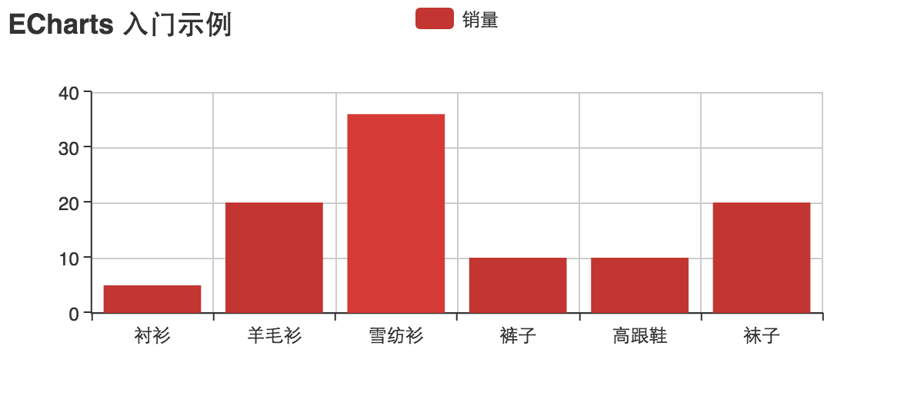

## 引入 ECharts

ECharts 3 开始不再强制使用 AMD 的方式按需引入，代码里也不再内置 AMD 加载器。因此引入方式简单了很多，只需要像普通的 JavaScript 库一样用 script 标签引入。

```
<!DOCTYPE html>
<html>
<header>
    <meta charset="utf-8">
    <!-- 引入 ECharts 文件 -->
    <script src="echarts.min.js"></script>
</header>
</html>

```


## 绘制一个简单的图表

在绘图前我们需要为 ECharts 准备一个具备高宽的 dom 容器。

```
<body>
    <!-- 为 ECharts 准备一个具备大小（宽高）的Dom -->
    <div id="main" style="width: 600px;height:400px;"></div>
</body>
```

然后就可以通过 echarts.init 方法初始化一个 echarts 实例并通过 setOption 方法生成一个简单的柱状图，下面是完整代码。

```
<!DOCTYPE html>
<html>
<head>
    <meta charset="utf-8">
    <title>ECharts</title>
    <!-- 引入 echarts.js -->
    <script src="echarts.js"></script>
</head>
<body>
    <!-- 为ECharts准备一个具备大小（宽高）的Dom -->
    <div id="main" style="width: 600px;height:400px;"></div>
    <script type="text/javascript">
        // 基于准备好的dom，初始化echarts实例
        var myChart = echarts.init(document.getElementById('main'));

        // 指定图表的配置项和数据
        var option = {
            title: {
                text: 'ECharts 入门示例'
            },
            tooltip: {},
            legend: {
                data:['销量']
            },
            xAxis: {
                data: ["衬衫","羊毛衫","雪纺衫","裤子","高跟鞋","袜子"]
            },
            yAxis: {},
            series: [{
                name: '销量',
                type: 'bar',
                data: [5, 20, 36, 10, 10, 20]
            }]
        };

        // 使用刚指定的配置项和数据显示图表。
        myChart.setOption(option);
    </script>
</body>
</html>

```
这样你的第一个图表就诞生了！

